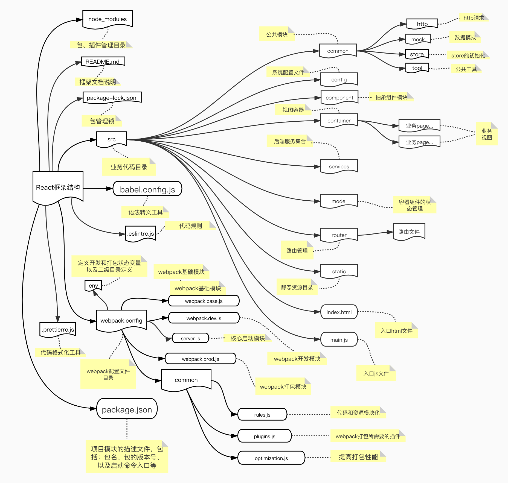
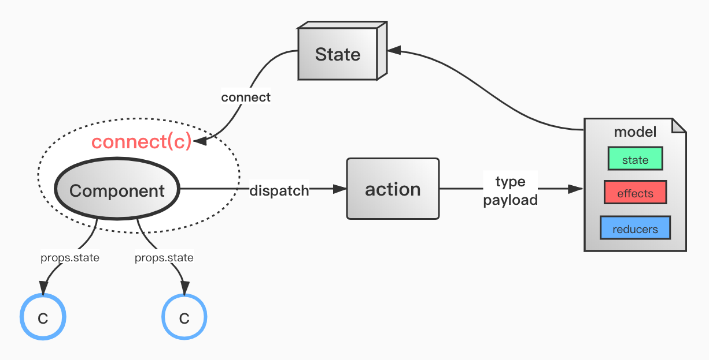

# 框架介绍

### 名称:

   前端 PC 端框架（[代码规范](./deploy/前端规范/README.md)）

---

### 简介:

   本项目运用前端技术为：html、css、less、javaScript、react、react-router、
redux、react-redux、redux-saga、axios、antd、js-base64、react-router-config

---

### 依赖:

- 1、开发工具 WebStorm 或 visual studio code
- 2、打包依赖：webpack（^4.43.0）版本
- 3、转义依赖：babel 系列（^7 版本）
- 4、语法规范依赖：eslint（^7.3.1 版本）
- 5、样式规范依赖：`stylelint(^10.1.0 版本)`、`stylelint-config-prettier(^5.3.0)`、`stylelint-config-standard（^18.3.0）`
- 6、开发框架依赖：react（^16.13.1 版本）

---

### vscode `eslint插件（2.1.8）`、`stylelint插件(0.84.0)`编辑器配置

```
{
    "eslint.enable": true,
    "eslint.autoFixOnSave": true,
    "eslint.run": "onType",
    "eslint.options": {
	"extensions": [".js",".vue",".json"]
    },
    "eslint.validate": [
        "javascriptreact",
        "vue",
        "javascript", {
            "language": "vue",
            "autoFix": true
        },
        "html", {
          "language": "html",
          "autoFix": true
        }
],
"editor.codeActionsOnSave": {
    "source.fixAll": true
},
"editor.suggestSelection": "first",
"vsintellicode.modify.editor.suggestSelection": "automaticallyOverrodeDefaultValue",
"emmet.includeLanguages": {
"javascript":"javascriptreact"
},
"[json]": {
    "editor.defaultFormatter": "esbenp.prettier-vscode"
},
"[vue]": {
    "editor.defaultFormatter": "esbenp.prettier-vscode"
},
"[javascript]": {
    "editor.defaultFormatter": "esbenp.prettier-vscode"
},
"window.zoomLevel": 0,
}
```

### 相关命令:

1. 安装依赖:
   npm/cnpm install
2. 运行:
   npm run dev
3. 编译:
   npm run build

编译后文件存在 dist 目录下

---

#框架说明

### 执行入口:

1. html 入口
   src/index.html
2. js 入口
   src/main.js

---

### 框架总体架构图:



---

### 模块划分

1. 容器组件(业务大的模块)务必在 model 文件夹下面建立自己的容器 model，共享状态
2. 业务组件(基本业务模块)根据自己业务需求，定义该模块的状态
3. 容器组件的数据流转图
   
